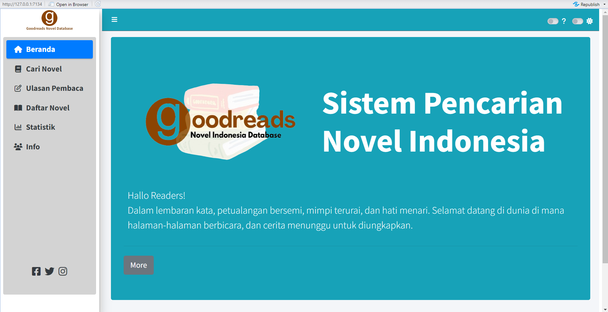

<p align="center" style="width: 800px; height: 400px;">
  
</p>

<div align="center">

# Goodreads Novel Indonesia Database

[Tentang](#scroll-tentang)
•
[Informasi](#pushpin-informasi)
•
[Screenshot](#rice_scene-screenshot)
•
[Demo](#dvd-demo)

</div>

## :bookmark_tabs: Menu

- [Tentang](#scroll-tentang)
- [Informasi](pushpin-informasi)
- [Screenshot](#rice_scene-screenshot)
- [Demo](#dvd-demo)
- [Requirements](#exclamation-requirements)
- [Skema Database](#floppy_disk-skema-database)
- [ERD](#rotating_light-erd)
- [Deskripsi Data](#heavy_check_mark-deskripsi-data)
- [Struktur Folder](#open_file_folder-struktur-folder)
- [Tim Pengembang](#smiley_cat-tim-pengembang)

## :scroll: Tentang

<div align="justify">
Selamat datang di Goodreads Novel Indonesia Database.
Goodreads Novel Indonesia adalah teman setia para pencinta buku, membantu Anda menemukan novel-novel yang sesuai dengan selera dan minat Anda. Sumber daya lengkap untuk menemukan dan menikmati novel-novel terbaik dari penulis Indonesia! Dari kisah-kisah yang mendebarkan hingga petualangan yang memukau, kami hadir untuk memudahkan Anda menemukan cerita-cerita yang memikat hati dan pikiran. Jelajahi dunia yang kaya dengan judul-judul menarik dan penulis berbakat, serta nikmati ulasan-ulasan berkualitas dari komunitas pembaca kami. Temukan petualangan baru di setiap halaman, hanya di Goodreads Novel Indonesia!

Dengan informasi terkini dan ulasan yang dapat dipercaya, kami siap membawa Anda dalam perjalanan menemukan cerita-cerita tak terlupakan. Jadikan Goodreads Novel Indonesia sebagai panduan Anda dalam dunia literasi Indonesia yang kaya dan memikat!

## :pushpin: Informasi
Projek ini merupakan tugas akhir mata kuliah Praktikum Manajemen Data Statistika, Program Magister Statistika dan Sains Data, IPB University. Projek ini mengambil topik tentang Database Novel Indonesia. Tugas akhir ini membahas terkait novel, penulis, penerbit, serta ulasan yang telah diberikan pembaca. Dataset yang digunakan berasal dari website [goodreads](https://www.goodreads.com/list/show/67567.Novel_Indonesia_Terbaik). Hasil yang diharapkan adalah berupa platform basis data dalam bentuk aplikasi web agar memudahkan pengguna dalam mencari referensi novel yang mereka inginkan berdasarkan beberapa pilihan seperti penulis, penerbit, rating, serta dapat mengetahui ulasan dari pengguna lain untuk lebih tau secara mendalam terkait novel yang diinginkan.

## :rice_scene: Screenshot

<p align="center">
  
</p>

## :dvd: Demo

Berikut merupakan link untuk shinnyapps atau dashboard dari project kami: https://rahmiandr.shinyapps.io/project_MDSkel3/

## :exclamation: Requirements

- Data diperoleh dari website [goodreads](https://www.goodreads.com/list/show/67567.Novel_Indonesia_Terbaik) dengan memilih novel Indonesia Terbaik.    
- RDBMS yang digunakan adalah PostgreSQL dan ElephantSQL
- Dashboard menggunakan `shinny`, `shinnythemes`, `bs4Dash`, `DT`, dan `dplyr` dari package R

## :floppy_disk: Skema Database
Menggambarkan struktur *primary key* **novel**, **penulis**, **penerbit** dan **ulasan** dengan masing-masing *foreign key* dalam membangun relasi antara tabel atau entitas.

<p align="center" style="width: 800px; height: 400px;">
  
</p>


## :rotating_light: ERD
ERD (Entity Relationship Diagram) menampilkan hubungan antara entitas dengan atribut. Pada project ini, entitas novel memiliki dua atribut yang berhubungan dengan atribut pada entitas lain, yaitu id_penulis berhubungan dengan entitas penulis dan id_penerbit berhubungan dengan entitas penerbit.
Selain itu, entitas ulasan dan entitas novel saling berhubungan pada atribut id_novel.

<p align="center" style="width: 800px; height: 400px;">
  
</p>

## :heavy_check_mark: Deskripsi Data
Goodreads Novel Indonesia adalah sebuah database novel-novel terbaik Indonesia yang ditulis oleh putra-putri terbaik bangsa. Data ini diambil berdasarkan rating yang telah diberikan pembaca sehingga menghasilkan novel-novel terbaik dengan rating tertinggi. Data yang digunakan meliputi data Novel, Penulis, Penerbit, dan Ulasan.

Berisi tentang tabel-tabel yang digunakan berikut dengan sintaks SQL DDL (CREATE).

### Create Database
Database Novel Indonesia menyimpan informasi yang mewakili atribut data yang saling berhubungan untuk kemudian dianalisis.
```sql
CREATE DATABASE novel_indo
    WITH
    OWNER = postgres
    ENCODING = 'UTF8'
    CONNECTION LIMIT = -1
    IS_TEMPLATE = False;
```
### Create Table penulis
Table penulis memberikan informasi kepada user mengenai identitas penulis novel Indonesia, sehingga user dapat mengetahui id penulis, nama penulis, tempat lahir penulis, tanggal lahir penulis, dan jumlah buku yang telah diterbitkan oleh penulis tersebut. Id penulis adalah kode yang digunakan untuk membedakan nama penulis yang sama pada tiap novel. Berikut deskripsi untuk setiap tabel penulis.
| Attribute          | Type                  | Description                     |
|:-------------------|:----------------------|:--------------------------------|
| id_penulis         | varchar(10)           | Id Penulis                      |
| nama_penulis       | varchar(100)          | Nama Penulis                    |
| tempat_lahir       | varchar(100)          | Tanggal Lahir Penulis           |
| tanggal_lahir      | date 	             | Tanggal Lahir Penulis           |
| jumlah_buku        | integer		     | Jumlah Buku yang Telah Terbit   |

dengan script SQL sebagai berikut:
```sql
CREATE TABLE IF NOT EXISTS public.penerbit (
	id_penerbit varchar(10) COLLATE pg_catalog."default" NOT NULL,
    nama_penerbit varchar(100),
    alamat varchar(100),
    PRIMARY KEY (id_penerbit)
);
```
### Create Table Penerbit
Table penerbit memberikan informasi yang memudahkan user mengetahui informasi dari penerbit novel Indonesia tersebut melalui id penerbit, nama penerbit dan alamat penerbit terkait. Id penerbit adalah kode yang digunakan untuk membedakan nama penerbit yang sama pada tiap novel. Berikut deskripsi untuk setiap tabel penerbit.
| Attribute          | Type                  | Description                     	|
|:-------------------|:----------------------|:---------------------------------|
| id_penerbit        | varchar(10)	     | Id Penerbit		       	|
| nama_penerbit      | varchar(100) 	     | Nama Penerbit Novel              |
| alamat	     | varchar(100) 	     | Alamat Perusahaan Penerbit Novel |

dengan script SQL sebagai berikut:
```sql
CREATE TABLE IF NOT EXISTS public.penulis (
	id_penulis character varying(10) NOT NULL,
    nama_penulis character varying(100) NOT NULL,
    tempat_lahir character varying(100),
    tanggal_lahir date,
    jumlah_buku integer,
    PRIMARY KEY (id_penulis)
);
```
### Create Table Novel
Table novel memberikan informasi kepada user mengenai informasi terkait novel Indonesia. User dapat mengetahui id novel, siapa penulis dan penerbit novel melalui id penulis dan id penerbit. Selain itu juga memuat informasi tak kalah penting seperti judul novel, ISBN, bahasa tulisan, tahun terbit novel, edisi keberapa, jumlah halaman novel, deskripsi novel, dan rating novel yang diberikan pembaca secara keseluruhan.
| Attribute              | Type                  | Description                     		       |
|:-----------------------|:----------------------|:----------------------------------------------------|
| id_novel               | varchar(10) 		 | Id Novel                     	     	       |
| id_penulis             | varchar(10) 		 | Id Penulis                  	    		       |
| id_penerbit            | varchar(10)  	 | Id Penerbit                    		       |	
| judul                  | varchar(200) 	 | Judul Novel                 		       	       |
| ISBN              	 | varchar(50)		 | Kode Identifikasi Buku               	       |
| bahasa    	    	 | varchar(15)           | Bahasa yabg Digunakan dalam Penulisan Nobel         |
| tahun_terbit      	 | integer		 | Tahun Terbitnya Novel     			       |
| edisi    		 | varchar(50)           | Versi khusus dari Novel			       |
| jumlah_halaman    	 | integer               | Jumlah Halaman pada Novel			       |
| deskripsi    		 | varchar(10000)        | Gambaran Singkat dari Isi Novel		       |
| rating_novel    	 | integer               | Peringkat Rata-Rata dari para Pembaca	       |


dengan script SQL sebagai berikut:
```sql
CREATE TABLE IF NOT EXISTS public.novel (
	id_novel character varying(10) NOT NULL,
    id_penulis character varying(10) NOT NULL,
    id_penerbit character varying(10) NOT NULL,
    judul character varying(200) NOT NULL,
    ISBN character varying(50),
    bahasa character varying(15),
    tahun_terbit integer,
    edisi character varying(50),
    jumlah_halaman integer,
    deskripsi character varying(10000),
    rating_novel integer,
	CONSTRAINT novel_pkey PRIMARY KEY (id_novel),
    CONSTRAINT novel_id_penulis_fkey FOREIGN KEY (id_penulis)
        REFERENCES public.penulis (id_penulis) MATCH SIMPLE
        ON UPDATE NO ACTION
        ON DELETE NO ACTION,
    CONSTRAINT penerbit_id_penerbit_fkey FOREIGN KEY (id_penerbit)
        REFERENCES public.penerbit (id_penerbit) MATCH SIMPLE
        ON UPDATE NO ACTION
        ON DELETE NO ACTION
);
```

### Create Table Ulasan
Table ulasan menyajikan informasi lengkap mengenai informasi ulasan dari para pembaca novel. Selain dapat mengetahui judul, user juga akan mendapatkan informasi doi dan tahun terbit sebuah artikel. Nama penulis, team penulis hingga urutan penulis tersaji pada table ini. Tidak hanya itu, akan ditampilkan pula nama penerbit dan nama jurnal yang dipercayakan penulis untuk mempublikasikan karyanya. Lebih lanjut, informasi spesifik mengenai id sinta, id departemen, id instansi dan id paper dapat diketahui melalui table ini.  Berikut deskripsi untuk setiap tabel judul.
| Attribute                  | Type                  | Description                     		       |
|:---------------------------|:----------------------|:------------------------------------------------|
| id_user                    | varchar(10) 	     | Id User                       		       |
| id_novel                   | varchar(10)           | Id Novel                 		       |
| nama_user                  | varchar(100)          | Nama Pembaca yang Mengirim Ulasan               |	
| tanggal_ulasan             | date                  | Tanggal Pembaca Mengirim Ulasan                 |
| ulasan                     | varchar(10000)        | Komentar yang Diberikan Pembaca Terhadap Novel  |
| rating    	             | integer               | Peringkat yang Diberikan Pembaca untuk Novel    |


dengan script SQL sebagai berikut:              
```sql
CREATE TABLE IF NOT EXISTS public.ulasan (
    id_user character varying(20) NOT NULL,
    id_novel character varying(20) NOT NULL,
    nama_user character varying(100) NOT NULL,
    tanggal_ulasan date,
    ulasan character varying(10000) ,
    rating_user integer,
    CONSTRAINT user_pkey PRIMARY KEY (id_user),
    CONSTRAINT user_id_novel_fkey FOREIGN KEY (id_novel)
        REFERENCES public.novel (id_novel) MATCH SIMPLE
		ON UPDATE NO ACTION
        ON DELETE NO ACTION
);
```

## :open_file_folder: Struktur Folder

```
.
├── app           # ShinyApps
│   ├── server.R
│   └── ui.R
│
├── data 
│   ├── novel.csv
│   ├── penerbit.csv
│   ├──	penulis.csv
|   └── ulasan.csv
│
├── image
│   ├── ERD fix.png
│   ├── Skema MDS fix.png
│   ├──	dashboard.png
|   ├──	logo.png
|   ├──	logobaru.png
|   └── logo-removebg.png
│   
├── src		# Project source code
│   ├──	conn_elephantsql.R
|   └──	inputdatasql.R
| 
└── README.md
```

## :smiley_cat: Tim Pengembang
+ Database Manager : [Ratu Risha Ulfia](https://github.com/Raturisha) (G1501231041)
+ Frontend Developer : [Yunia Hasnataeni](https://github.com/YuniaHasnataeni) (G1501231001)
+ Backend Developer : [Rahmi Anadra](https://github.com/rahmiandr) (G1501231051)
+ Technical Writer : [Monica Rahma Fauziah](https://github.com/monicarahma) (G1501231057)
