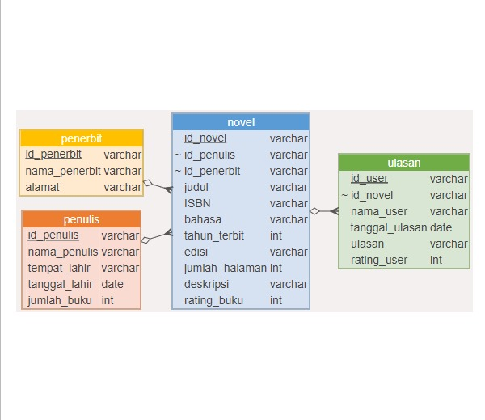

<p align="center" style="width: 800px; height: 400px;">
  
</p>

<div align="center">

# Goodreads Novel Indonesia Database

[Tentang](#scroll-tentang)
•
[Screenshot](#rice_scene-screenshot)
•
[Demo](#dvd-demo)
•
[Dokumentasi](#blue_book-dokumentasi)

</div>

## :bookmark_tabs: Menu

- [Tentang](#scroll-tentang)
- [Screenshot](#rice_scene-screenshot)
- [Demo](#dvd-demo)
- [Dokumentasi](#blue_book-dokumentasi)
- [Requirements](#exclamation-requirements)
- [Skema Database](#floppy_disk-skema-database)
- [ERD](#rotating_light-erd)
- [Deskripsi Data](#heavy_check_mark-deskripsi-data)
- [Struktur Folder](#open_file_folder-struktur-folder)
- [Tim Pengembang](#smiley_cat-tim-pengembang)

## :scroll: Tentang

<div align="justify">
Selamat datang di Goodreads Novel Indonesia Database, informasi lengkap untuk pecinta novel tanah air! Kami adalah database novel yang memberikan informasi lengkap seputar novel Indonesia yang tersedia di Goodreads, memungkinkan pengguna untuk menjelajahi dan menemukan berbagai jenis novel dari berbagai genre. Dengan berbagai judul dan penulis yang terdaftar, kami menyajikan informasi terkini dan ulasan berkualitas dari komunitas Goodreads yang dapat membantu para calon pembaca untuk menemukan novel yang dinginkan.

## :rice_scene: Screenshot

<p align="center">
  
</p>

## :dvd: Demo

Berikut merupakan link untuk shinnyapps atau dashboard dari project kami:
https://akmarinak98.shinyapps.io/database_publikasi_statistika/

## :blue_book: Dokumentasi 

Dokumentasi penggunaan aplikasi database. Anda dapat juga membuat dokumentasi lives menggunakan readthedocs.org (opsional).

## :exclamation: Requirements

- Data diperoleh dari website [[goodreads](https://www.goodreads.com/list/show/67567.Novel_Indonesia_Terbaik) dengan memilih novel Indonesia Terbaik.    
- RDBMS yang digunakan adalah PostgreSQL dan ElephantSQL
- Dashboard menggunakan `shinny`, `shinnythemes`, `bs4Dash`, `DT`, dan `dplyr` dari package R
- 
## :floppy_disk: Skema Database
Menggambarkan struktur *primary key* **novel**, **penulis**, **penerbit** dan **ulasan** dengan masing-masing *foreign key* dalam membangun relasi antara tabel atau entitas.

<p align="center" style="width: 800px; height: 400px;">
  
</p>


## :rotating_light: ERD
ERD (Entity Relationship Diagram) menampilkan hubungan antara entitas dengan atribut. Pada project ini, entitas judul terdapat tiga atribut yang berhubungan dengan atribut pada entitas lain, yaitu id_sinta berhubungan dengan entitas penulis, id_instansi berhubungan dengan entitas instansi, id_dept berhubungan dengan entitas departemen.

Selanjutnya, entitas penulis terdapat dua atribut yang berhubungan dengan atribut pada entitas lain, yaitu id_instansi berhubungan dengan entitas instansi, id_dept bergubungan dengan entitas departemen.

Selain itu, entitas departemen dan entitas instansi saling berhubungan pada atribut id_instansi.

<p align="center" style="width: 800px; height: 400px;">
  
</p>

## :heavy_check_mark: Deskripsi Data

Berisi tentang tabel-tabel yang digunakan berikut dengan sintaks SQL DDL (CREATE).

### Create Database
Databse Sinta Jurnal menyimpan informasi yang mewakili atribut data yang saling berhubungan untuk kemudian dianalisis.
```sql
CREATE DATABASE novel_indo
    WITH
    OWNER = postgres
    ENCODING = 'UTF8'
    CONNECTION LIMIT = -1
    IS_TEMPLATE = False;
```
### Create Table penulis
Table penulis memberikan informasi kepada user mengenai identitas penulis novel Indonesia, sehingga user dapat mengetahui id penulis, nama penulis, tempat lahir penulis, tanggal lahir penulis, dan jumlah buku yang telah diterbitkan oleh penulis tersebut. Id penulis adalah kode yang digunakan untuk membedakan nama penulis yang sama pada tiap novel. Berikut deskripsi untuk setiap tabel penulis.
| Attribute          | Type                  | Description                     |
|:-------------------|:----------------------|:--------------------------------|
| id_penulis         | varchar(10)           | Id Penulis                      |
| nama_penulis       | varchar(100)          | Nama Penulis                    |
| tempat_lahir       | varchar(100)          | Tanggal Lahir Penulis           |
| tanggal_lahir      | date 	               | Tanggal Lahir Penulis           |
| jumlah_buku        | integer		           | Jumlah Buku yang Telah Terbit   |

dengan script SQL sebagai berikut:
```sql
CREATE TABLE IF NOT EXISTS public.penerbit (
	id_penerbit varchar(10) COLLATE pg_catalog."default" NOT NULL,
    nama_penerbit varchar(100),
    alamat varchar(100),
    PRIMARY KEY (id_penerbit)
);
```
### Create Table Penerbit
Table penerbit memberikan informasi yang memudahkan user mengetahui informasi dari penerbit novel Indonesia tersebut melalui id penerbit, nama penerbit dan alamat penerbit terkait. Id penerbit adalah kode yang digunakan untuk membedakan nama penerbit yang sama pada tiap novel. Berikut deskripsi untuk setiap tabel penerbit.
| Attribute          | Type                  | Description                     |
|:-------------------|:----------------------|:--------------------------------|
| id_dept            | character varying(10) | Id Departemen                   |
| id_instansi        | character varying(10) | Id Instansi                     |
| nama_instansi      | character varying(50) | Nama Instansi                   |

dengan script SQL sebagai berikut:
```sql
CREATE TABLE IF NOT EXISTS public.penulis (
	id_penulis character varying(10) NOT NULL,
    nama_penulis character varying(100) NOT NULL,
    tempat_lahir character varying(100),
    tanggal_lahir date,
    jumlah_buku integer,
    PRIMARY KEY (id_penulis)
);
```
### Create Table Novel
Table novel memberikan informasi kepada user mengenai beberapa identitas penulis jurnal. User dapat mengetahui id sinta dari penulis, nama penulis jurnal, asal penulis melalui id instnasi dan id departemen. Selain itu, terdapat informasi mengenai jumlah artikel yang telah diterbitkan oleh penulis baik terindeks scopus maupun google scholar. Berikut deskripsi untuk setiap tabel penulis.
| Attribute                  | Type                  | Description                     		       |
|:---------------------------|:----------------------|:------------------------------------------------|
| id_sinta                   | character varying(10) | Id Sinta                       		       |
| nama_penulis               | character varying(100)| Nama Penulis                   		       |
| id_instansi                | character varying(10) | Id Instansi                     		       |	
| id_dept                    | character varying(10) | Id Departemen                 		       |
| subject_list               | character varying(150)| Bidang Ilmu yang Dikuasai Penulis               |
| sinta_score_ovr    	     | smallint              | Jumlah Skor Sinta                               |
| jumlah_article_scopus      | smallint		     | Jumlah Artikel yang Terbitkan oleh Scopus       |
| jumlah_article_gscholar    | smallint              | Jumlah Artikel yang Terbitkan oleh Google Sholar|

dengan script SQL sebagai berikut:
```sql
CREATE TABLE IF NOT EXISTS public.novel (
	id_novel character varying(10) NOT NULL,
    id_penulis character varying(10) NOT NULL,
    id_penerbit character varying(10) NOT NULL,
    judul character varying(200) NOT NULL,
    ISBN character varying(50),
    bahasa character varying(15),
    tahun_terbit integer,
    edisi character varying(50),
    jumlah_halaman integer,
    deskripsi character varying(10000),
    rating_buku integer,
	CONSTRAINT novel_pkey PRIMARY KEY (id_novel),
    CONSTRAINT novel_id_penulis_fkey FOREIGN KEY (id_penulis)
        REFERENCES public.penulis (id_penulis) MATCH SIMPLE
        ON UPDATE NO ACTION
        ON DELETE NO ACTION,
    CONSTRAINT penerbit_id_penerbit_fkey FOREIGN KEY (id_penerbit)
        REFERENCES public.penerbit (id_penerbit) MATCH SIMPLE
        ON UPDATE NO ACTION
        ON DELETE NO ACTION
);
```

### Create Table Ulasan
Table ulasan menyajikan informasi lengkap mengenai sebuah artikel. Selain dapat mengetahui judul, user juga akan mendapatkan informasi doi dan tahun terbit sebuah artikel. Nama penulis, team penulis hingga urutan penulis tersaji pada table ini. Tidak hanya itu, akan ditampilkan pula nama penerbit dan nama jurnal yang dipercayakan penulis untuk mempublikasikan karyanya. Lebih lanjut, informasi spesifik mengenai id sinta, id departemen, id instansi dan id paper dapat diketahui melalui table ini.  Berikut deskripsi untuk setiap tabel judul.
| Attribute                  | Type                  | Description                     		       |
|:---------------------------|:----------------------|:------------------------------------------------|
| id_sinta                   | character varying(10) | Id Sinta                       		       |
| id_instansi                | character varying(10) | Id Instansi                  		       |
| id_dept                    | character varying(10) | Id Departemen                   		       |	
| id_paper                   | character varying(10) | Id Jurnal/Artikel                	       |
| judul_paper                | character varying(200)| Judul Paper                                     |
| nama_penerbit    	     | character varying(100)| Nama Penerbit                                   |
| nama_journal               | character varying(100)| nama_journal     			       |
| jenulis_ke		     | smallint              | Urutan Nama Penulis pada Jurnal		       |
| jumlah_penulis             | smallint		     | Jumlah Penulis                    	       |
| team_penulis               | character varying(100)| Nama-Nama Penulis                               |
| tahun_terbit    	     | character varying(4)  | Tahun Terbit                                    |
| doi	                     | character varying(50) | Tautan Persisten yang Menghubungkan ke Jurnal   |
| accred		     | character varying(10) | Akreditasi            			       |

dengan script SQL sebagai berikut:              
```sql
CREATE TABLE IF NOT EXISTS public.ulasan (
    id_user character varying(20) NOT NULL,
    id_novel character varying(20) NOT NULL,
    nama_user character varying(100) NOT NULL,
    tanggal_ulasan date,
    ulasan character varying(10000) ,
    rating_user integer,
    CONSTRAINT user_pkey PRIMARY KEY (id_user),
    CONSTRAINT user_id_novel_fkey FOREIGN KEY (id_novel)
        REFERENCES public.novel (id_novel) MATCH SIMPLE
		ON UPDATE NO ACTION
        ON DELETE NO ACTION
);
```

## :open_file_folder: Struktur Folder

```
.
├── app           # ShinyApps
│   ├── css
│   │   ├── **/*.css
│   ├── server.R
│   └── ui.R
├── data 
│   ├── csv
│   │   ├── **/*.css
│   └── sql
|       └── db.sql
├── src           # Project source code
├── doc           # Doc for the project
├── .gitignore
├── LICENSE
└── README.md
```

## :smiley_cat: Tim Pengembang
+ Database Manager : [Ratu Risha Ulfia](https://github.com/Raturisha) (G1501231041)
+ Frontend Developer : [Yunia Hasnataeni](https://github.com/YuniaHasnataeni) (G1501231001)
+ Backend Developer : [Rahmi Anadra](https://github.com/rahmiandr) (G1501231051)
+ Technical Writer : [Monica Rahma Fauziah](https://github.com/monicarahma) (G1501231057)
